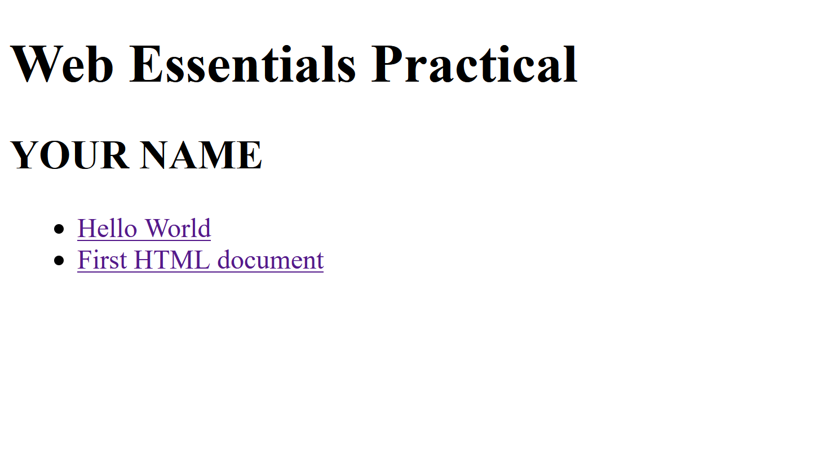
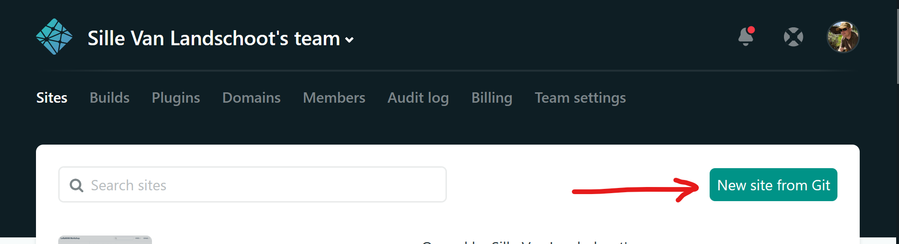
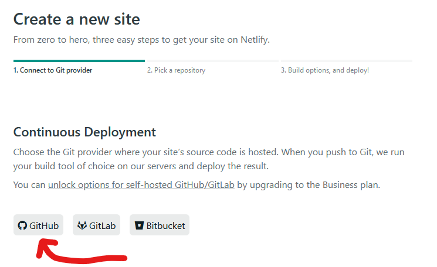
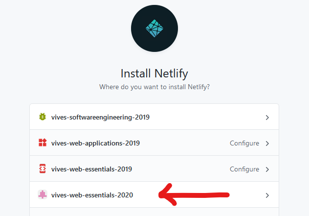
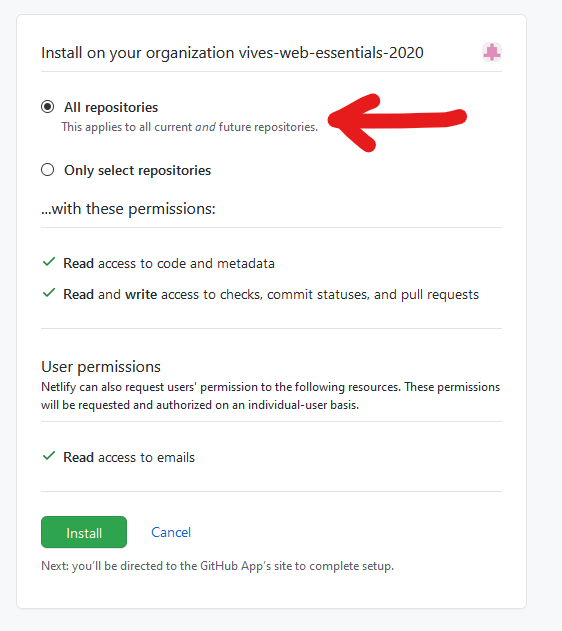
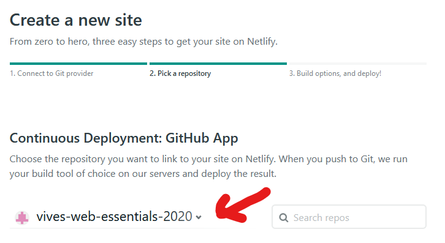
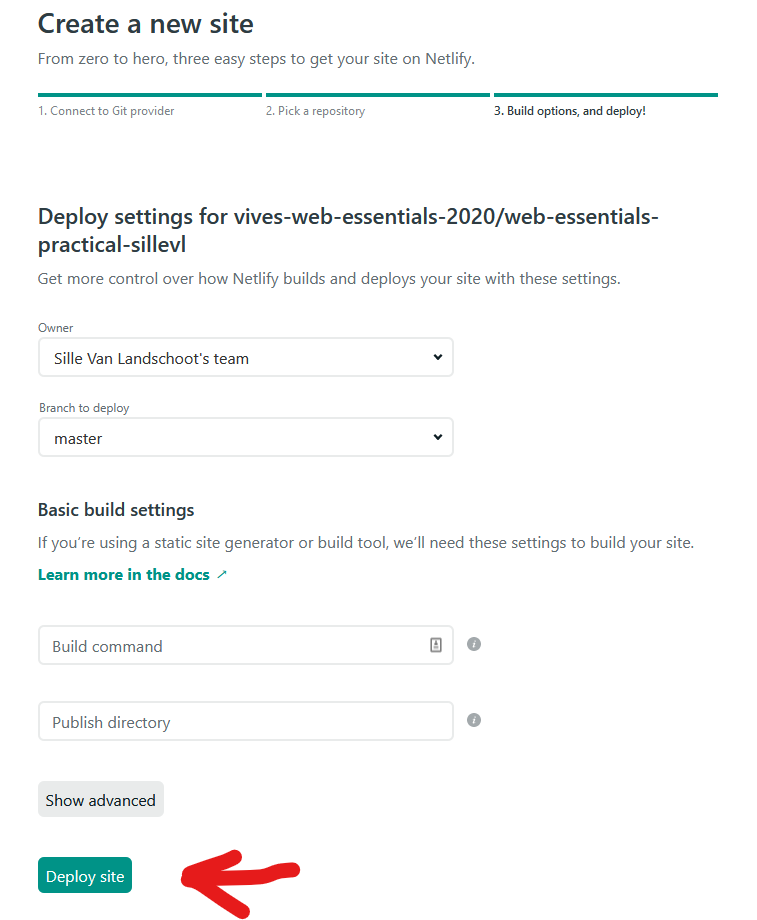

# Publishing the result on Netlify

Lets get our webpages hosted on a real server on the internet. Lets use [Netlify](https://netlify.com) as a free hosting provider. But first we need to create a landing page.

## Minimal Landing page

This project will contain multiple exercises, challanges and assignments. To get an overview and an easy way to navigate through the different webpages, a landing page should be provided.

A landing page is just a page listing all the projects and providing a link to navigate to them.

Create a new document in the `root` of this project (`root` directory ~= `web-essentials-practical-yourGitHubName`). Name this file `index.html` so that it is fetched by default.

You can copy/paste the following HTML code inside the `<body>` element.

```html
<h1>Web Essentials Practical</h1>
<h2>YOUR NAME</h2>
<ul>
    <li><a href="/01-hello-world/hello-world">Hello World</a></li>
    <li><a href="/01-hello-world/first-html-document">First HTML document</a></li>
</ul>
```

Just replace `YOUR NAME` with your fist and last name.

## Testing it out on your computer

To test this applicaton, lets start a webserver in the `root` directory. Open your powershell in the `web-essentials-practical-yourGitHubName` and start the `serve` command.

You should get something like this:



Try it out by clicking on the links and watch the result. You can now easily navigate to different projects.

## Commiting everything and push it to GitHub

Now that we are ready and that everything is working like expected you should commit everything and push it to GitHub using the following commands in your powershell. Make sure you are in the `root` directory called `web-essentials-practical-yourGitHubName`.

```shell
git status
git add .
git commit -m"add minimal landing page for netlify"
git push origin master
```

## Publishing to Netlify

Surf to [Netlify](https://netlify.com) and log in using your GitHub account. You should get the follwing screen where you can see a _New site from Git_ button. Press this button to create a new site.



On the next page, click on GitHub to tell Netlify that the source code of our website lives on GitHub.



Netlify will now get access to all your GitHub projects. You might need to configure this first by clicking on the link `Configure the Netlify app on GitHub.` And will get a screen like this:



Click on `web-essentials-practical` to configure it. Make sure to select `All repositories`



Click `install`.

You should now be able to change between GitHub organisations. Select `vives-web-essentials-2020` and you should be able to see your own project `web-essentials-practical-yourGitHubName` listed below.



Click on your project called `web-essentials-practical-yourGitHubName`.

Now you can configure the deployment options. Just leave everything at default and click on `Deploy site` at the bottom of the page.



Your website is now being fetched from GitHub and being prepared by Netlify. This process might take a minute. You will be notified when everything is ready. You should get a page looking like this.


Note that Netlify will choose a random name for your project. This name is used in the URL that is used for your website as well. In this example the name is `peaceful-mclean-4324dc`. The website is available using the URL `https://peaceful-mclean-4324dc.netlify.app/`. Checkout your link and try to surf to your webpage on Netlify.

::: warning URL sharing
Only share your URL with people that you want to be able to visit your webpage. If you share your URL with other students, they will be able to watch all your source code and solutions!!!
:::

## Updating your webpage on Netlify

Updating your webpage on Netlify is very easy. Your Netlify website is linked to your GitHub project. Just `push` your changes to GitHub and Netlify will do the rest. A moment later your changes will be visible on your Netlify website. Easy eh?!
